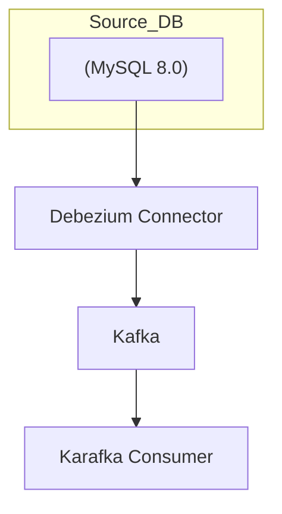

# Rails CDC Pipeline: A Development Guide

## 目次

1.  [1. 概要](#1-概要)
2.  [2. 環境構築手順](#2-環境構築手順)
3.  [3. パイプラインの実行と検証](#3-パイプラインの実行と検証)
4.  [4. トラブルシュート](#4-トラブルシュート)

## 1. 概要

本文書は、Rails, MySQL, Debezium, Kafka, Karafka を用いたCDC（Change Data Capture）パイプラインの構築手順を詳述するものです。アプリケーションの実行環境は、DockerおよびDocker Composeによって完全にコンテナ化されています。

### 1.1. アーキテクチャ

本システムの主要コンポーネントは以下の通りです。

- **Rails (Consumer & Web App)**: Unicornサーバーで稼働するWebアプリケーション。Karafkaフレームワークを介してKafkaトピックからデータベースの変更イベントを非同期に受信します。
- **MySQL**: プライマリデータベース。全てのデータ変更は、Debeziumの監視対象となるバイナリログに記録されます。
- **Debezium**: MySQLのバイナリログを監視し、行レベルの変更（挿入、更新、削除）をキャプチャーしてKafkaトピックにイベントとして発行するCDCプラットフォーム。
- **Kafka & Zookeeper**: Debeziumが発行した変更イベントを格納し、Railsアプリケーション（Karafka）に中継するための分散メッセージングシステム。



### 1.2. セットアップ方針

本ガイドでは、再現性と明確性を最優先し、以下の2段階のプロセスで環境を構築します。

1.  **Stage 1: Railsアプリケーションのスケルトン生成**: `rails new` コマンドを実行し、標準的なRailsアプリケーションの雛形を作成します。
2.  **Stage 2: CDCパイプライン用のカスタム構成適用**: 自動生成されたファイル群に対し、本プロジェクト固有の設定（Docker環境、Unicornサーバー、Karafkaコンシューマー、CDCパイプラインサービス）を適用していきます。

### 1.3. バージョン互換性と固定

本ガイドでは **再現性** を重視し、以下のバージョンで動作確認を行っています。最新版を使用する場合は、公式ドキュメントを参照し互換性を確認してください。

| ソフトウェア | 動作確認済みバージョン | 備考 |
|-------------|----------------------|------|
| Ruby        | 3.2.2               | `ruby:3.2.2` イメージ |
| Rails       | 7.1.x (`~> 7.1.3`) | Gemfile で固定 |
| MySQL       | 8.0                 | Official image tag |
| Debezium    | 1.6.x               | 2.x 系を使う場合は Connector 設定に差異あり |
| Kafka/ZK    | Debezium 同梱 1.6   |  |
| Karafka     | 2.3.x (`~> 2.3.0`) | Gemfile で固定 |

バージョンを固定することで **docker build の再現性** を高めています。

---

## 2. 環境構築手順

### Stage 1: Railsアプリケーションのスケルトン生成

まず、Railsアプリケーションの土台を構築します。

#### ステップ 1-1: 初期ファイルの作成

空のプロジェクトディレクトリを作成し、`rails new` コマンドを実行するために最低限必要なファイル群を配置します。

1.  **`Gemfile`**:
    `rails new`コマンドの実行には、`rails` gemそのものへの依存関係定義が必要です。
    ```ruby
    # RubyGemsの公式リポジトリをパッケージの取得元として指定
    source "https://rubygems.org"
    
    # 使用するRubyのバージョンを明示
    ruby "3.2.2"
    
    # Railsフレームワーク本体のgemを指定
    gem "rails", "~> 7.1.3"
    ```

2.  **`Dockerfile`**:
    Dockerコンテナ内でRuby環境を準備し、`rails new`を実行するための最小限の定義です。
    ```dockerfile
    # Dockerfileの文法バージョンを指定
    # syntax=docker/dockerfile:1
    
    # ベースイメージとして公式のRubyイメージを指定
    ARG RUBY_VERSION=3.2.2
    FROM ruby:$RUBY_VERSION
    
    # コンテナ内の作業ディレクトリを設定
    WORKDIR /usr/src/app
    ```

3.  **`docker-compose.yml`**:
    `rails new`コマンドを実行する`app`サービスだけを一時的に定義します。`command: sleep infinity`でコンテナを起動したままにし、コマンド実行のプラットフォームとして利用します。
    ```yaml
    version: '3.8'
    services:
      app:
        # Dockerfileを元にコンテナイメージをビルド
        build: .
        # コンテナを起動したままにするためのダミーコマンド
        command: sleep infinity
        # ホストのカレントディレクトリをコンテナの作業ディレクトリにマウント
        # これにより、コンテナ内でのファイル生成がホスト側に反映される
        volumes:
          - .:/usr/src/app
    ```

#### ステップ 1-2: `Gemfile.lock` の生成

`bundle install` を実行し、`Gemfile`に記述された依存関係を解決し、バージョンを固定した`Gemfile.lock`を生成します。これは再現性の高いビルドに不可欠です。

```bash
# --rm: コマンド実行後にコンテナを自動で削除
# app: docker-compose.ymlで定義したサービス名
# bundle install: コンテナ内で実行するコマンド
docker-compose run --rm app bundle install
```

#### ステップ 1-3: Railsスケルトンの生成

`rails new` コマンドを実行し、アプリケーションの雛形を生成します。`--force`で既存ファイルを上書きし、`--database=mysql`でMySQL用の設定を生成します。

```bash
# .: カレントディレクトリにアプリケーションを生成
# --force: 既存のファイルを上書き
# --database=mysql: MySQLをデータベースとして設定
docker-compose run --rm app rails new . --force --database=mysql
```

このステップが完了すると、カレントディレクトリに完全なRailsアプリケーションのファイル構造が作成されます。

---

### Stage 2: CDCパイプライン用のカスタム構成適用

次に、生成されたRailsアプリケーションに対し、本プロジェクト固有の構成を適用していきます。

#### ステップ 2-1: 環境変数ファイルの作成

セキュリティのベストプラクティスとして、データベースのパスワードをコードに直接記述する代わりに、環境変数で管理します。まず、プロジェクトのルートに`.env`ファイルを作成します。

```bash
# .envファイルを作成し、データベースのパスワードを設定
# "your_secure_password" の部分は、より強力なパスワードに置き換えてください
echo "DB_PASSWORD=your_secure_password" > .env
```
*注意: この`.env`ファイルは、`.gitignore`に追記してGitリポジトリにコミットしないようにしてください。*

#### ステップ 2-2: 設定ファイルの上書きと作成

以下の内容で、`rails new` によって生成されたファイルを上書き、または新規作成します。

1.  **`Gemfile`** (上書き):
    標準の`puma`サーバーを`unicorn`に置き換え、Kafkaコンシューマーとして`karafka`を追加します。各Gemの役割をコメントで明記しました。
    ```ruby
    source "https://rubygems.org"
    
    ruby "3.2.2"
    
    # --- CDCパイプラインの必須Gem ---
    gem "rails", "~> 7.1.3"         # Railsフレームワーク本体
    gem "mysql2", ">= 0.4.4"        # MySQLデータベースアダプタ
    gem "unicorn"                   # Webサーバー (Pumaの代替)
    gem "karafka", "~> 2.3.0"       # Kafkaコンシューマーフレームワーク（バージョン固定推奨）
    
    # --- Rails標準のGem (任意だが、Webアプリケーションとして機能させるために推奨) ---
    gem "sprockets-rails"           # Asset Pipeline用
    gem "importmap-rails"           # JavaScript管理
    gem "turbo-rails"               # Hotwireフレームワーク
    gem "stimulus-rails"            # Hotwireフレームワーク
    gem "jbuilder"                  # JSONレスポンス生成
    
    # --- 開発・テスト用の補助Gem (本番環境では不要な場合もある) ---
    gem "tzinfo-data", platforms: %i[ windows jruby ] # タイムゾーン情報
    gem "bootsnap", require: false  # Rails起動高速化
    
    group :development, :test do
      gem "debug", platforms: %i[ mri windows ] # デバッガー
    end
    
    group :development do
      gem "web-console"               # ブラウザベースのデバッグコンソール
    end
    
    group :test do
      gem "capybara"                  # E2Eテスト用
      gem "selenium-webdriver"        # E2Eテスト用
    end
    ```

2.  **`Dockerfile`** (上書き):
    `rails new`が生成した複雑なDockerfileを、開発・検証用途に最適化したシンプルなビルドプロセスに置き換えます。
    ```dockerfile
    # syntax = docker/dockerfile:1
    ARG RUBY_VERSION=3.2.2
    FROM ruby:3.2.2
    
    WORKDIR /usr/src/app
    
    # Railsの動作に必要なOSパッケージをインストール
    RUN apt-get update -qq && apt-get install -y build-essential libv8-dev libpq-dev nodejs default-mysql-client
    
    # Node.js は importmap / esbuild 等を使用しない場合は不要。軽量化したい場合は nodejs を削除してもよい。
    
    # GemfileとGemfile.lockをコピーし、bundle installを先に実行することで
    # Dockerのレイヤーキャッシュを有効にし、ビルド時間を短縮する
    COPY Gemfile Gemfile.lock ./
    RUN bundle install
    
    # アプリケーションコード全体をコピー
    COPY . /usr/src/app
    
    # entrypoint.shスクリプトをコンテナにコピーし、実行権限を付与
    COPY entrypoint.sh /usr/bin/
    RUN chmod +x /usr/bin/entrypoint.sh
    # このコンテナのデフォルトのエントリーポイントとして設定
    ENTRYPOINT ["entrypoint.sh"]

    # コンテナの3000番ポートを外部に公開
    EXPOSE 3000
    
    # コンテナ起動時に実行されるデフォルトのコマンド (Unicornサーバーの起動)
    CMD ["bundle", "exec", "unicorn", "-p", "3000", "-c", "./config/unicorn.rb"]
    ```

3.  **`docker-compose.yml`** (上書き):
    完全なCDCパイプラインを定義し、`.env`ファイルからパスワードを読み込むように設定します。
    ```yaml
    version: '3.8'
    services:
      # --- データベースサービス ---
      db:
        image: mysql:8.0
        command: --default-authentication-plugin=mysql_native_password
        # .envファイルから環境変数を読み込む
        env_file:
          - .env
        volumes:
          - mysql-data:/var/lib/mysql
          - ./my.cnf:/etc/mysql/conf.d/my.cnf
        environment:
          # .envファイル内の DB_PASSWORD を使用
          MYSQL_ROOT_PASSWORD: ${DB_PASSWORD}
          MYSQL_DATABASE: app_development
        ports:
          - "3306:3306"
    
      # --- Railsアプリケーションサービス ---
      app:
        build: .
        command: bundle exec unicorn -p 3000 -c ./config/unicorn.rb
        # .envファイルから環境変数を読み込む
        env_file:
          - .env
        volumes:
          - .:/usr/src/app
          - bundle_data:/usr/local/bundle
        ports:
          - "3000:3000"
        depends_on:
          - db
        environment:
          # .envファイル内の DB_PASSWORD をコンテナ内の環境変数として渡し、
          # config/database.yml から参照できるようにする
          DB_PASSWORD: ${DB_PASSWORD}
    
      # --- Zookeeperサービス (Kafkaのメタデータ管理) ---
      zookeeper:
        image: debezium/zookeeper:1.6
        ports:
          # 2181: クライアント(Kafka, Debezium等)からの接続用ポート
          - "2181:2181"
          # 2888: Zookeeperクラスタ内の他ノードとの通信用ポート (フォロワーがリーダーに接続)
          - "2888:2888"
          # 3888: Zookeeperクラスタのリーダー選出用ポート
          - "3888:3888"
    
      # --- Kafkaサービス (メッセージブローカー) ---
      kafka:
        image: debezium/kafka:1.6
        ports:
          - "9092:9092"
        links:
          - zookeeper
        environment:
          - ZOOKEEPER_CONNECT=zookeeper:2181
          - KAFKA_ADVERTISED_LISTENERS=PLAINTEXT://kafka:9092
        depends_on:
          - zookeeper
    
      # --- Debezium Connectサービス (CDC) ---
      connect:
        image: debezium/connect:1.6
        ports:
          - "8083:8083"
        links:
          - kafka
          - db
        depends_on:
          - kafka
          - db
          - zookeeper
        environment:
          - BOOTSTRAP_SERVERS=kafka:9092
          - GROUP_ID=1
          - CONFIG_STORAGE_TOPIC=my_connect_configs
          - OFFSET_STORAGE_TOPIC=my_connect_offsets
          - STATUS_STORAGE_TOPIC=my_connect_statuses
    
    volumes:
      mysql-data:
      bundle_data:
    ```

4.  **`config/database.yml`** (上書き):
    `app`コンテナに渡された環境変数 `DB_PASSWORD` を使ってDBに接続するように修正します。
    ```yaml
    # config/database.yml
    default: &default
      adapter: mysql2
      encoding: utf8mb4
      pool: <%= ENV.fetch("RAILS_MAX_THREADS") { 5 } %>
      username: root
      # docker-compose.yml経由で渡された環境変数 DB_PASSWORD を参照
      password: <%= ENV['DB_PASSWORD'] %>
      host: db
    
    development:
      <<: *default
      database: app_development
    
    test:
      <<: *default
      database: app_test
    
    production:
      <<: *default
      database: app_production
      username: app
      password: <%= ENV["APP_DATABASE_PASSWORD"] %>
    ```

5.  **`my.cnf`** (新規作成):
    Debeziumが変更をキャプチャできるよう、MySQLのバイナリログを有効にします。
    ```ini
    [mysqld]
    log-bin=mysql-bin
    server-id=1
    binlog_format=ROW
    binlog_row_image=FULL
    expire_logs_days=10
    gtid_mode=ON
    enforce_gtid_consistency=ON
    log_slave_updates=ON
    default-time-zone='+00:00'
    ```

6.  **`entrypoint.sh`** (新規作成):
    コンテナ起動時に、Unicornの動作に必要なディレクトリを作成するスクリプトです。
    ```bash
    #!/bin/bash
    set -e
    
    mkdir -p /usr/src/app/tmp/sockets
    mkdir -p /usr/src/app/tmp/pids
    
    if [ -f /usr/src/app/tmp/pids/unicorn.pid ]; then
      rm /usr/src/app/tmp/pids/unicorn.pid
    fi
    
    exec "$@"
    ```

7.  **`config/unicorn.rb`** (新規作成):
    Unicornサーバーの設定ファイルです。
    ```ruby
    working_directory "/usr/src/app"
    pid "/usr/src/app/tmp/pids/unicorn.pid"
    stderr_path "/usr/src/app/log/unicorn.stderr.log"
    stdout_path "/usr/src/app/log/unicorn.stdout.log"
    listen "/usr/src/app/tmp/sockets/unicorn.sock", backlog: 64
    listen 3000, tcp_nopush: true
    worker_processes 2
    timeout 30
    ```

#### ステップ 2-3: 依存関係の更新とイメージの再ビルド

`Gemfile` と `Dockerfile` を更新したため、依存関係を再インストールし、アプリケーションイメージを再ビルドします。

1.  **依存関係の更新**:
    ```bash
    docker-compose run --rm app bundle install
    ```
2.  **イメージの再ビルド**:
    ```bash
    docker-compose build
    ```

#### ステップ 2-4: Karafkaのセットアップ

Karafkaのインストーラーを実行し、`karafka.rb`などの設定ファイルを生成します。

```bash
docker-compose run --rm app bundle exec karafka install
```

---

## 3. パイプラインの実行と検証

全ての構成が完了しました。実際にパイプラインを稼働させ、動作を検証します。

#### ステップ 3-1: 全サービスの起動

`docker-compose up -d` コマンドで、定義した全てのサービスをバックグラウンドで起動します。

```bash
docker-compose up -d
```
*備考: Debezium (`connect`サービス) は起動に時間がかかり、メモリを多く消費する場合があります。*

#### ステップ 3-2: データベースのセットアップ

1.  **データベースの作成**:
    ```bash
    docker-compose run --rm app bundle exec rails db:create
    ```
    *`already exists`と表示された場合は、以前の操作で作成済みのため問題ありません。*

2.  **テーブルの作成**:
    ```bash
    docker-compose run --rm app bundle exec rails generate model User name:string email:string
    ```
    ```bash
    docker-compose run --rm app bundle exec rails db:migrate
    ```

#### ステップ 3-3: Debeziumコネクタの登録

`curl`コマンドでDebeziumにMySQLコネクタを登録します。**`"database.password"`の値は、ご自身が `.env` ファイルに設定したものに置き換えてください。**

```bash
# Debezium ConnectのREST API (localhost:8083) にPOSTリクエストを送信
# "database.password" には、.envファイルで設定したパスワードを記述してください
curl -i -X POST \
  -H "Accept:application/json" \
  -H "Content-Type:application/json" \
  localhost:8083/connectors/ \
  -d '{
    "name": "inventory-connector",
    "config": {
      "connector.class": "io.debezium.connector.mysql.MySqlConnector",
      "tasks.max": "1",
      "database.hostname": "db",
      "database.port": "3306",
      "database.user": "cdc",
      "database.password": "${DB_PASSWORD}",
      "database.server.id": "1",
      "database.server.name": "dbserver1",
      "database.include.list": "app_development",
      "database.history.kafka.bootstrap.servers": "kafka:9092",
      "database.history.kafka.topic": "dbhistory.inventory"
    }
  }'
```
`HTTP/1.1 201 Created` というレスポンスが返ることを確認してください。

事前に MySQL 上で **最小権限ユーザー** `cdc` を作成しておくと安全です。

```sql
CREATE USER 'cdc'@'%' IDENTIFIED BY '${DB_PASSWORD}';
GRANT SELECT, REPLICATION SLAVE, REPLICATION CLIENT ON *.* TO 'cdc'@'%';
```

#### ステップ 3-4: Karafkaコンシューマーの実装と設定

1.  **コンシューマーの作成**:
    `app/consumers/users_consumer.rb` を作成します。
    ```ruby
    # app/consumers/users_consumer.rb
    class UsersConsumer < ApplicationConsumer
      def consume
        messages.each do |message|
          Rails.logger.info "Received message from Kafka: #{message.payload}"
        end
      end
    end
    ```

2.  **ルーティング設定**:
    `karafka.rb` を編集し、Debeziumからのトピックを `UsersConsumer` にルーティングします。
    ```ruby
    # karafka.rb
    class KarafkaApp < Karafka::App
      setup do |config|
        config.kafka = { 'bootstrap.servers': 'kafka:9092' }
        config.client_id = 'test_rails_app'
        # Debeziumが生成するトピック名に対応するため、厳格な名前空間チェックを無効化
        config.strict_topics_namespacing = false
        config.consumer_persistence = !Rails.env.development?
      end
    
      Karafka.monitor.subscribe(Karafka::Instrumentation::LoggerListener.new)
      Karafka.producer.monitor.subscribe(WaterDrop::Instrumentation::LoggerListener.new(Karafka.logger))
    
      routes.draw do
        consumer_group :users_consumers_fresh do
          topic 'dbserver1.app_development.users' do
            consumer UsersConsumer
          end
        end
      end
    end
    ```
    *備考: Karafkaインストーラが生成した `example_consumer.rb` は不要なため削除してください。*

#### ステップ 3-5: 動作検証

1.  **Karafkaサーバーの起動**:
    ターミナルでKarafkaサーバーを起動し、メッセージを待ち受けます。
    ```bash
    docker-compose run --rm app bundle exec karafka server
    ```

2.  **データ変更の発生**:
    **別のターミナル**を開き、`rails console` で`User`レコードを作成します。
    ```bash
    docker-compose exec app bundle exec rails c
    ```
    ```ruby
    # Railsコンソール内
    User.create(name: "Taro Yamada", email: "taro@example.com")
    ```

3.  **結果の確認**:
    Karafkaサーバーのターミナルに`Received message from Kafka:`というログとJSONペイロードが出力されていれば、CDCパイプラインは正常に機能しています。

以上で、全てのセットアップと検証は完了です。

---

## 4. トラブルシュート

| 症状 | 典型的な原因 | 対処方法 |
|------|--------------|----------|
| Debezium `connect` コンテナが再起動を繰り返す | JVM メモリ不足 | `CONNECT_HEAP=2G` 環境変数を追加する |
| Karafka サーバーで `Buffer overflow` 例外 | Kafka メッセージが大きい | `config.max_bytes_per_partition` を調整 |
| MySQL binlog 読み出しで `Could not find first log file name` | binlog がローテートされた | `expire_logs_days` を延長 or Debezium コネクタを再作成 |
| `database.include.list` で意図しない DB がキャプチャされる | パラメータ名の誤字 | `database.include.list` / `table.include.list` を再確認 |
